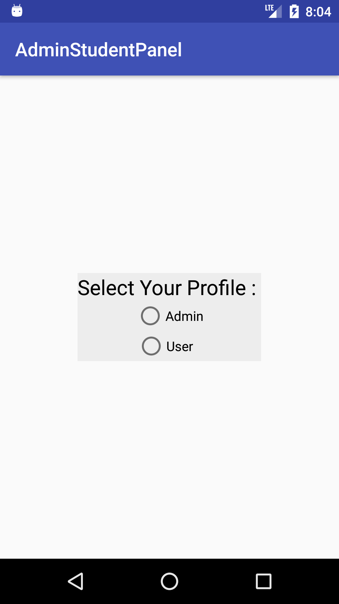
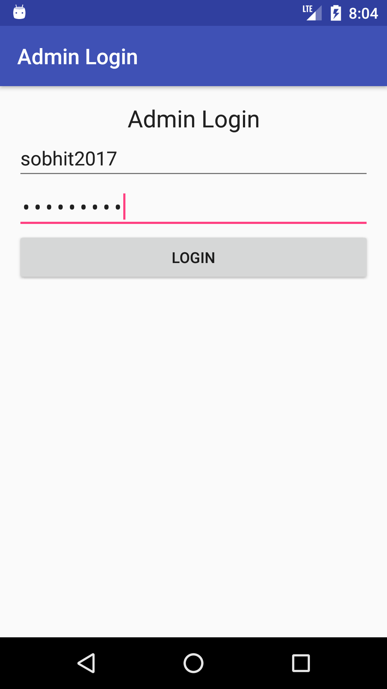
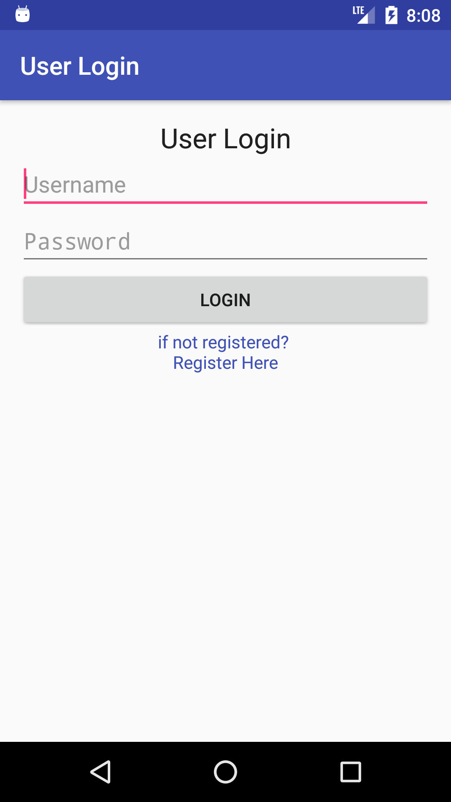
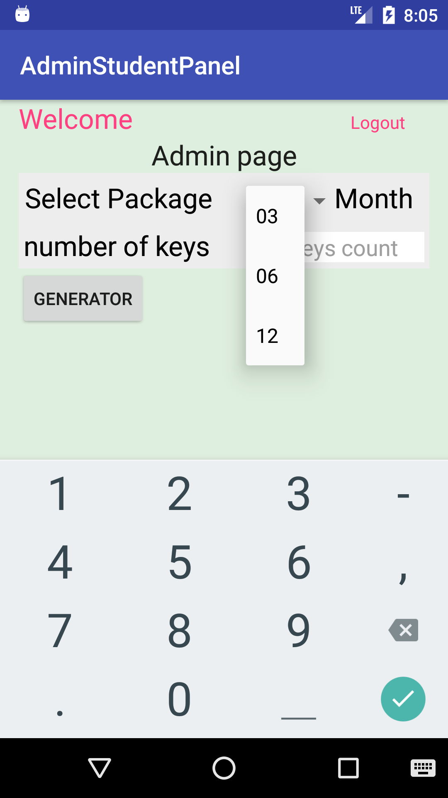
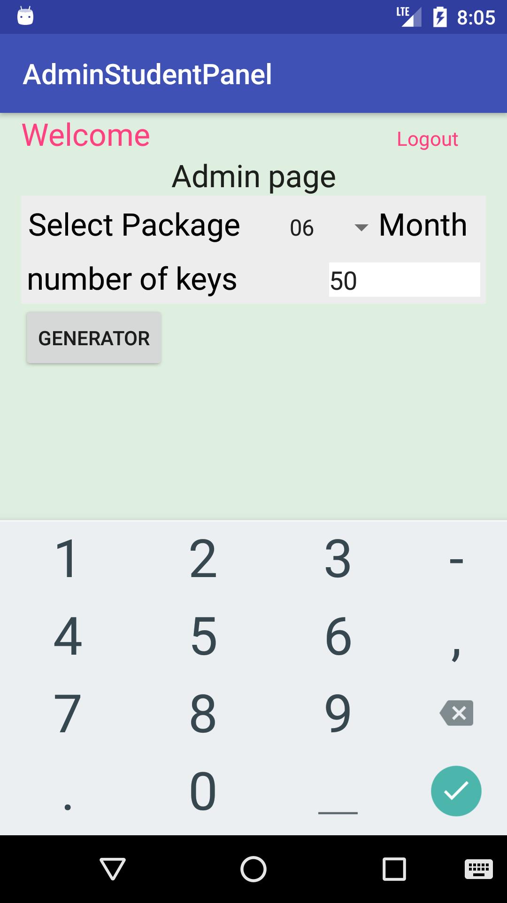
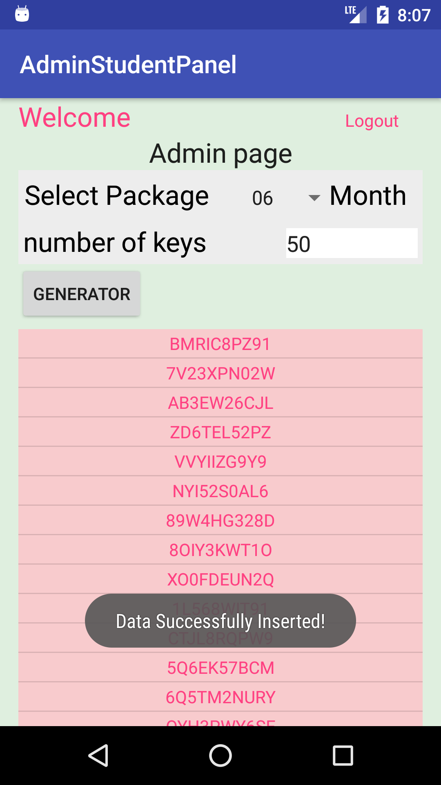
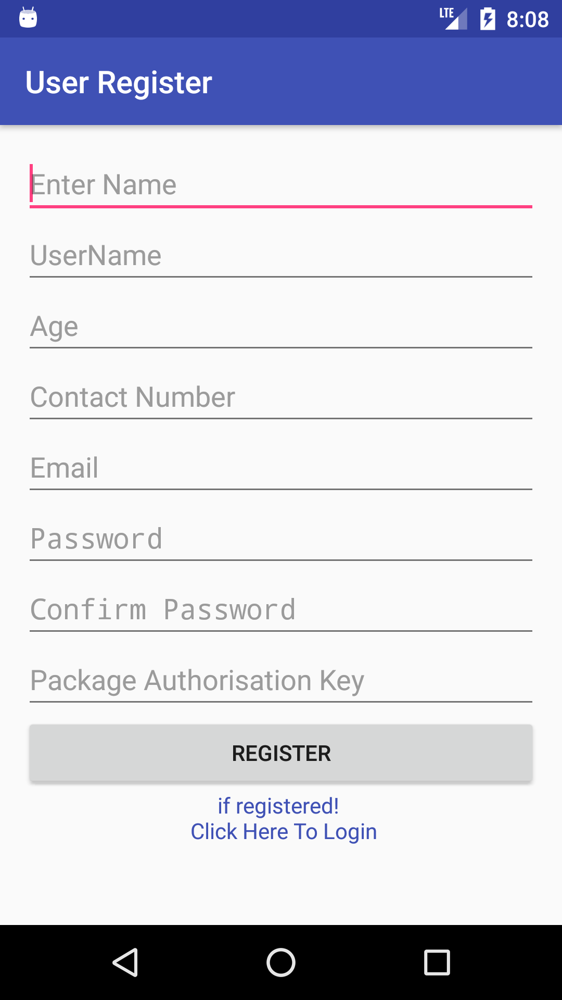
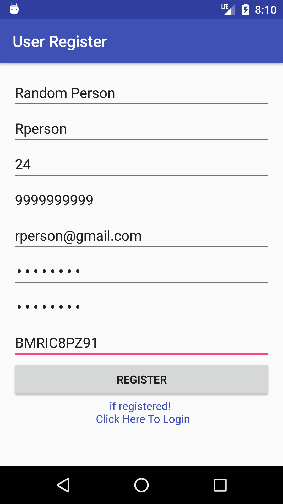

# AdminStudentPanel

This Repo imitates the **Admin-Student Dashboard**. App is Divide in **Two Section** As Per user's profile:
 - Admin
 - User
 
 Both Admin and User's profile are completely modular.One user can only be either Admin or normal user.
---
 | Select profile | Admin Page | User Page |
| :------------------------------------: | :------------------------------------: | :-----------------------: |
|  |  |  |

---
## About Admin profile:
* ** Admin Login Details**
 - Admin login details are **hardcoded** for now, Which can be changed later 
   > admin username = sobhit2017  password = kumar2017
* **Map Types:**
  * Normal Map
    > displays the default road map view. This is the default map type.
  * Satellite
    > displays Google Earth satellite images
  * Hybrid
    > displays a mixture of normal and satellite views
    
---
## for testing and better visibility Co- ordinate of New York is used which is:
> New York, USA         **lat = 40.7484**,   **lng = -73.9857**
---
## Admin:

| Step 1- Select Package | Step 2- Enter no of Keys | Step 3- Generate Auth Keys |
| :------------------------------------: | :------------------------------------: | :-----------------------: |
|  |  |  |

## User :
| Step 1- Login | Step 2- Register if not Login | Step 3- Enter Authentication Key |
| :------------------------------------: | :------------------------------------: | :-----------------------: |
|  |  | |

